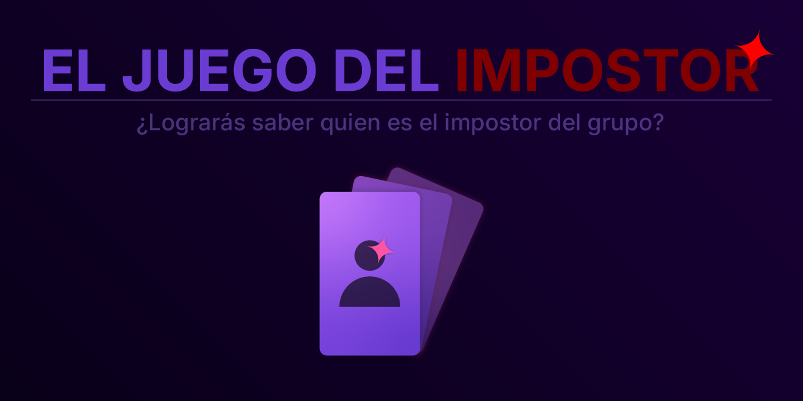

# ImpostorGame

_**(Ahora puedes instalar el juego como aplicación de teléfono dandole a guardar en pestaña de inicio)**_
## 🕵️‍♂️ Acerca del proyecto

**ImpostorGame** es un juego web creado para acompañar una actividad local y grupal conocida como *Juego del Impostor*.  

Está pensado para jugar en grupo, donde un **host define una palabra clave** y uno de los jugadores deberá ocultar que no la conoce.

El objetivo es fomentar la deducción, el engaño y la observación entre los participantes.

---

## 🎮 ¿Cómo se juega?

1. El **host** define una **palabra clave**.
2. El juego asigna de forma secreta a un jugador como **impostor**, quien **no conocerá la palabra**.
3. En rondas, cada jugador debe decir una palabra relacionada con la palabra clave.
4. El impostor deberá improvisar respuestas creíbles para pasar desapercibido.
5. En cualquier momento, el grupo puede decidir **votar por revelar al impostor para terminar la ronda**.
6. Si el grupo acierta, gana el equipo; si no, el impostor gana.

---

## 🧠 Objetivo del juego

- Detectar al impostor sin revelar demasiado la palabra clave.
- Para el impostor: mezclarse con el grupo sin levantar sospechas.

---

## 🛠️ Tecnologías utilizadas

- HTML
- CSS
- JavaScript

---

## 📚 Créditos y bibliografía

- Partículas de confetti utilizadas en la revelación del impostor:  
  👉 [canvas-confetti by catdad](https://github.com/catdad/canvas-confetti)

Gracias por compartir este genial recurso 💜

---

## 🚧 Estado del proyecto

El proyecto se encuentra en estado final, aunque puede recibir actualizaciones con mejoras o características adicionales.

---

## 📌 Autor

Desarrollado por **GabooDesign**  
Licenciado bajo la **Licencia MIT** 💖
